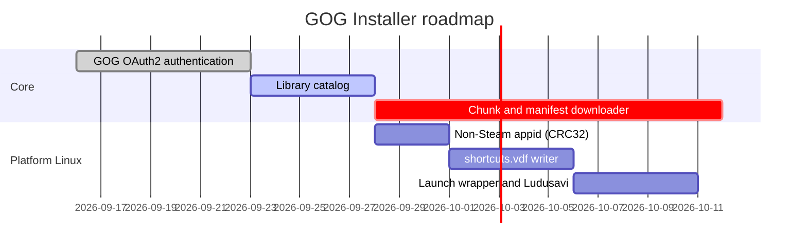

# AGENTS.md

Working agreement for any agent (human or AI) contributing to this repository.

## Language

**Every file described in this document — roadmap files, record files, and their
content — must be written in English.** This includes headings, task names, Gantt
chart labels, commit-related notes, and prose. Conversations may happen in any
language, but what lands in the repository is English.

## Roadmap

The roadmap lives in `ROADMAP/YYYY-MM-DD/`, where `YYYY-MM-DD` is the date the
roadmap revision was drafted. Each revision is a directory containing Markdown
files.

```
ROADMAP/
  2026-09-16/
    00-overview.md
    01-core.md
    02-platform-linux.md
    ...
```

Rules:

- A new roadmap revision means a **new dated directory**. Existing dated
  directories are historical: do not rewrite them, add a newer one instead.
- Files are Markdown (`.md`) and numbered so their reading order is obvious.
- Each roadmap revision includes a **Gantt chart written with Mermaid**, either in
  the overview file or in a dedicated file of the revision.

Example of the required Mermaid Gantt chart:

````markdown

````

Use the standard Mermaid task states (`done`, `active`, `crit`, `milestone`, or
none for pending work) so progress is readable straight from the chart. Do not pad task
names with spaces to align the columns: whatever precedes the `:` is the label,
trailing spaces included.

## Change records

Every change is recorded in a file under `RECORD/`:

```
RECORD/YYYY-MM-DD.<summary>.(WIP|completed).md
```

- `YYYY-MM-DD` — the date the work started.
- `<summary>` — a short, lowercase, dash-separated description
  (e.g. `gog-oauth-flow`, `shortcuts-vdf-writer`).
- `WIP` — work in progress. `completed` — work finished.

Examples:

```
RECORD/2026-09-16.project-bootstrap.completed.md
RECORD/2026-09-18.gog-oauth-flow.WIP.md
```

### Append-only

**Record files are append-only.** Once a line is written it is never edited or
deleted. New information goes at the end of the file, under a new timestamped
entry:

```markdown
## 2026-09-18 10:15 — Started

Implemented the code→token exchange against GOG's OAuth2 endpoint.

## 2026-09-18 16:40 — Update

Refresh-token rotation added; tokens stored in the platform keyring.
```

The one permitted change to an existing record file is **renaming** it from
`.WIP.md` to `.completed.md` when the work is done (use `git mv` so history is
preserved). Its content is still only ever appended to.

If a past record turns out to be wrong, do not correct it in place: append a new
entry that states the correction, or write a new record file that supersedes it.

### Suggested record structure

```markdown
# <Human readable title>

- **Status:** WIP | completed
- **Started:** YYYY-MM-DD
- **Roadmap:** ROADMAP/YYYY-MM-DD/<file>.md (if applicable)

## YYYY-MM-DD HH:MM — <entry title>

What was done, why, and anything the next contributor needs to know.
```

## Repository layout

```
AGENTS.md              This working agreement
README.md              Project introduction
docs/                  Design documents and technical notes
ROADMAP/YYYY-MM-DD/    Dated roadmap revisions (Markdown + Mermaid Gantt)
RECORD/                Append-only change records
```
