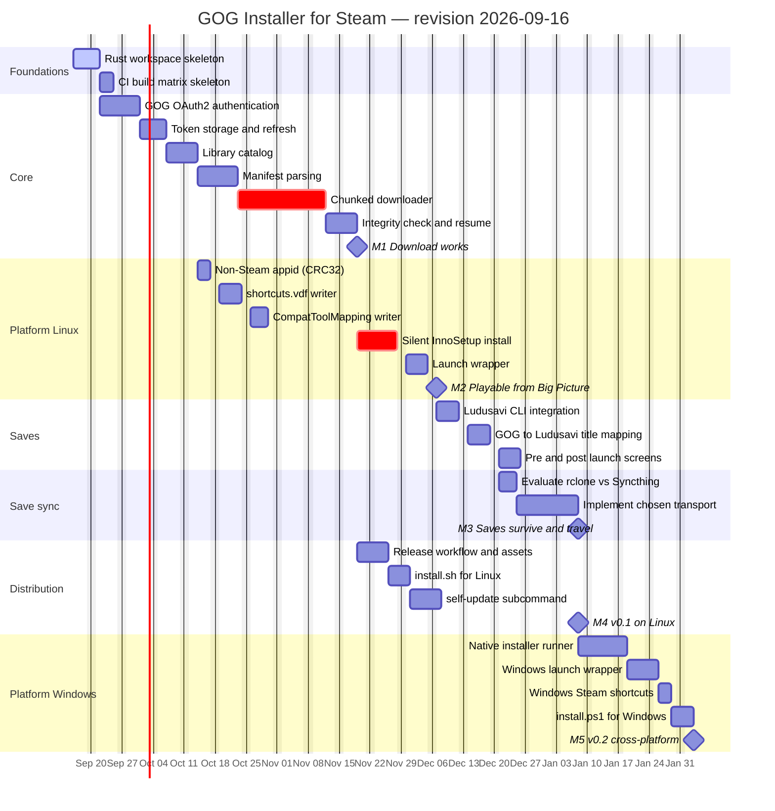

# Roadmap revision 2026-09-16 — Overview

First roadmap revision. It turns the design notes in
[`docs/gog-installer.md`](../../docs/gog-installer.md) into dated, ordered work.

## Goal

Ship a GOG installer that lives inside the Steam library of a gamescope + Big
Picture machine, so that games bought on GOG appear as ordinary Steam tiles,
launch through the Proton that Steam already manages, and keep their saves in
sync with a second (Windows) device.

## Scope of this revision

In scope:

- Rust workspace: `core`, `platform-linux`, `platform-windows`.
- GOG OAuth2 authentication, library catalog, chunk/manifest downloads.
- Steam integration on Linux: non-Steam `appid`, `shortcuts.vdf`,
  `CompatToolMapping`, launch wrapper.
- Silent installation of GOG (InnoSetup) installers through Proton.
- Ludusavi-backed save backup/restore and cross-device save sync.
- One-line install (`install.sh` / `install.ps1`) from GitHub releases.

Out of scope for this revision:

- Epic Games Store support.
- An in-game HUD overlay (`wlr-layer-shell`); pre/post-launch screens instead.
- Any hosted backend, unless the sync evaluation in
  [`05-save-sync.md`](05-save-sync.md) picks the custom-backend option.

## Phases

| # | Phase | Files |
|---|-------|-------|
| 0 | Foundations — workspace and CI skeleton | [01-foundations.md](01-foundations.md) |
| 1 | Core — auth, catalog, download | [02-core.md](02-core.md) |
| 2 | Platform Linux — Steam, Proton, install, launch | [03-platform-linux.md](03-platform-linux.md) |
| 3 | Saves — Ludusavi integration and feedback screens | [04-saves.md](04-saves.md) |
| 4 | Save sync — pick and implement a transport | [05-save-sync.md](05-save-sync.md) |
| 5 | Distribution — release matrix and one-line install | [06-distribution.md](06-distribution.md) |
| 6 | Platform Windows — native installer and wrapper | [07-platform-windows.md](07-platform-windows.md) |

Open questions that this revision does not settle are listed in
[08-open-questions.md](08-open-questions.md).

## Milestones

| ID | Milestone | Target | Meaning |
|----|-----------|--------|---------|
| M1 | Download works | 2026-11-19 | A game is authenticated, listed and downloaded from the CLI, with verified integrity. |
| M2 | Playable from Big Picture | 2026-12-07 | A GOG game installs silently through Proton and launches from a Steam tile. |
| M3 | Saves survive and travel | 2027-01-08 | Restore before play, backup after play, and the same save reachable from a second device. |
| M4 | `v0.1` on Linux | 2027-01-08 | One-line install, self-update, published release binaries. |
| M5 | `v0.2` cross-platform | 2027-02-03 | The same flow working natively on Windows. |

Durations are working days — the chart excludes weekends — and the target dates
follow from the dependencies, not from a commitment to a delivery date.

## Status at drafting time

Nothing is implemented yet. The repository holds the design document, `AGENTS.md`
and this roadmap. The workspace skeleton is the current focus; every other task
below is pending.

## Gantt

## Critical path

`ws → auth → tok → cat → man → dl → ver → inno → wrap → lud → map → seval →
simpl → M3 → M4`.

The two tasks marked critical are the ones most likely to move the whole chart:

- **Chunked downloader** — GOG's chunk/manifest protocol has no official
  specification; `gogdl` is the reference implementation to read.
- **Silent InnoSetup install** — behaviour under Proton varies per installer, and
  some titles ship installers that ignore `/VERYSILENT`.

## How to revise this

Per [`AGENTS.md`](../../AGENTS.md), this directory is historical. A later plan is a
new `ROADMAP/YYYY-MM-DD/` directory, not an edit of these files. Progress itself is
tracked in the append-only records under `RECORD/`; the task states in the Gantt
above are only refreshed when a new revision is drafted.
