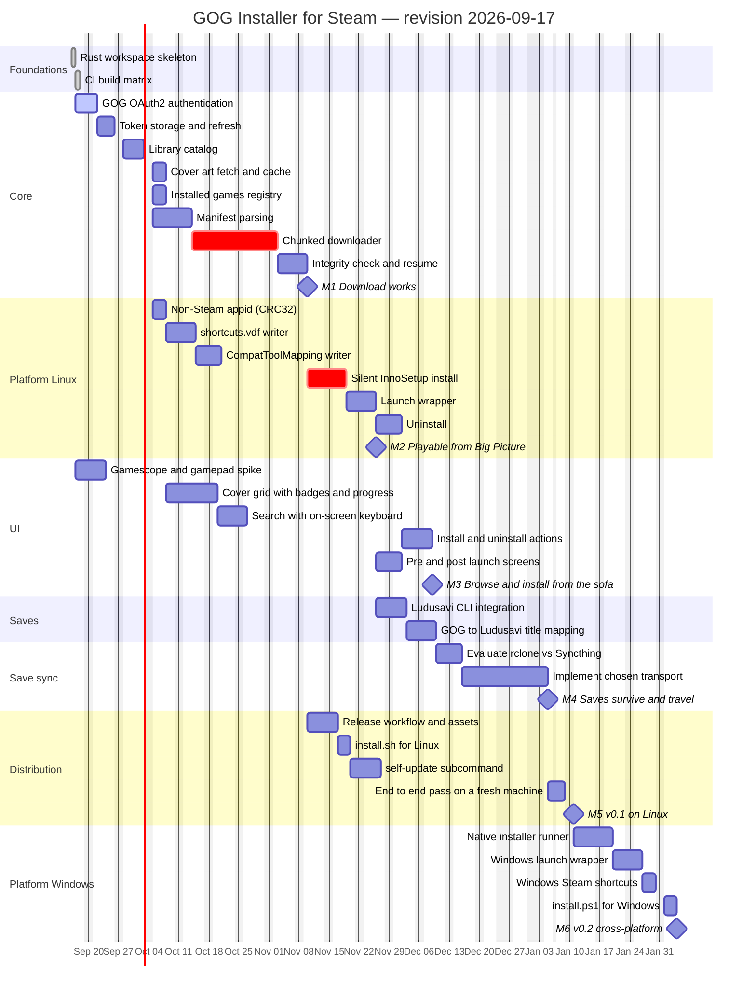

# Roadmap revision 2026-09-17 — Overview

Second roadmap revision. It supersedes [`ROADMAP/2026-09-16/`](../2026-09-16),
which stays as it was drafted.

## Goal

Unchanged: ship a GOG installer that lives inside the Steam library of a
gamescope + Big Picture machine, so that games bought on GOG appear as ordinary
Steam tiles, launch through the Proton that Steam already manages, and keep their
saves in sync with a second (Windows) device.

## What changed since 2026-09-16

- **Phase 0 is done.** The Rust workspace and the CI matrix are built and green on
  both targets — see
  [`RECORD/2026-09-16.workspace-and-ci-skeleton.completed.md`](../../RECORD/2026-09-16.workspace-and-ci-skeleton.completed.md).
- **There is a UI phase.** A controller-driven cover grid with per-game badges, an
  install progress bar, search with an on-screen keyboard, and install/uninstall
  actions. This settles open question 4 of the previous revision in favour of a
  tile-driven UI; the CLI stays as the headless path. See
  [`04-ui.md`](04-ui.md) and
  [`RECORD/2026-09-16.controller-ui-requirement.completed.md`](../../RECORD/2026-09-16.controller-ui-requirement.completed.md).
- **`feed` moved into the UI phase.** The pre/post launch screens are modes of the
  same UI binary, not a second toolkit.
- **The login flow is decided.** Manual authorization-code paste, because GOG has
  no device grant and the redirect is fixed on their side; the QR handoff from a
  phone is a nice to have in [`09-nice-to-haves.md`](09-nice-to-haves.md). See
  [`RECORD/2026-09-16.gog-login-flow-decision.completed.md`](../../RECORD/2026-09-16.gog-login-flow-decision.completed.md).
- **`auth` is in progress**, not pending: the flow is implemented and unit-tested,
  and what remains is verification against GOG itself. Its duration here is the
  remainder, which is why the early part of the chart is shorter than in the
  previous revision.
- **Three tasks are new in core and on Linux:** cover art fetching (`art`), the
  installed-games registry (`state`) that the badge and uninstall need, and
  `uninst`, the uninstall path itself.
- **Milestones are renumbered.** A UI milestone is inserted as M3, so what the
  previous revision called M3, M4 and M5 are M4, M5 and M6 here. Records written
  before today refer to the old numbering; the mapping is below.
- **The chart excludes Christmas and New Year**, not only weekends. Nothing is
  getting written on 24 December.

## Phases

| # | Phase | Files |
|---|-------|-------|
| 0 | Foundations — workspace and CI (done) | [01-foundations.md](01-foundations.md) |
| 1 | Core — auth, catalog, download | [02-core.md](02-core.md) |
| 2 | Platform Linux — Steam, Proton, install, launch | [03-platform-linux.md](03-platform-linux.md) |
| 3 | UI — cover grid, search, install and uninstall | [04-ui.md](04-ui.md) |
| 4 | Saves — Ludusavi integration | [05-saves.md](05-saves.md) |
| 5 | Save sync — pick and implement a transport | [06-save-sync.md](06-save-sync.md) |
| 6 | Distribution — release matrix and one-line install | [07-distribution.md](07-distribution.md) |
| 7 | Platform Windows — native installer and wrapper | [08-platform-windows.md](08-platform-windows.md) |
| — | Nice to haves, scheduled after the milestone they help | [09-nice-to-haves.md](09-nice-to-haves.md) |

Decisions still open are in [10-open-questions.md](10-open-questions.md).

## Milestones

| ID | Milestone | Target | Was | Meaning |
|----|-----------|--------|-----|---------|
| M1 | Download works | 2026-11-10 | M1 | A game is authenticated, listed and downloaded from the CLI, with verified integrity. |
| M2 | Playable from Big Picture | 2026-11-26 | M2 | A GOG game installs silently through Proton and launches from a Steam tile. |
| M3 | Browse and install from the sofa | 2026-12-09 | new | The cover grid installs and uninstalls games with a controller alone. |
| M4 | Saves survive and travel | 2027-01-05 | M3 | Restore before play, backup after play, and the same save reachable from a second device. |
| M5 | `v0.1` on Linux | 2027-01-11 | M4 | One-line install, self-update, published release binaries, verified on a fresh machine. |
| M6 | `v0.2` cross-platform | 2027-02-04 | M5 | The same flow working natively on Windows. |

Durations are working days. The chart excludes weekends and the winter holidays,
and the dates follow from the dependencies — they are not a delivery commitment,
and they do not model one contributor's capacity: tasks that overlap in the chart
are tasks that *may* overlap, not work happening in parallel.

## Status at drafting time

`ws` and `ci0` are done. `auth` is implemented and unit-tested but unverified
against GOG. Everything else is pending. Progress lives in the append-only records
under [`RECORD/`](../../RECORD); the task states in the chart below are only
refreshed when a new revision is drafted.

## Gantt

## Critical path

`auth → tok → cat → man → dl → ver → inno → wrap → lud → map → seval → simpl →
M4 → e2e → M5`.

The UI is **not** on the critical path, and that is deliberate: `grid` and
`search` can be finished and usable in October while the downloader is still being
written, because the grid only needs the catalog, the art cache and the registry.
What gates M3 is `actions`, which needs a working install.

The two tasks marked critical are still the ones most likely to move the whole
chart:

- **Chunked downloader** — GOG's chunk/manifest protocol has no official
  specification; `gogdl` is the reference implementation to read.
- **Silent InnoSetup install** — behaviour under Proton varies per installer, and
  some titles ship installers that ignore `/VERYSILENT`.

The `spike` in the UI phase exists to pull a third risk forward: gamescope focus,
gamepad mapping and legibility on a TV cannot be judged from a desktop, and
finding out in December would be late.

## How to revise this

Per [`AGENTS.md`](../../AGENTS.md), this directory becomes historical the moment a
newer one exists. A later plan is a new `ROADMAP/YYYY-MM-DD/` directory, not an
edit of these files.
